# 计算机图形学系统说明书

#### 张玄逸 201220194

#### 联系方式：1822771416@qq.com

---

#### 实现环境

操作系统：Windows 10 家庭中文版，64位

Python版本：3.6.5

vscode版本：version 1.67

---

#### 系统简介

- cg_cli：在终端运行，接收两个参数，第一个是包含指令的输入文件的路径，第二个是输出存储的路径。如python cg_cli.py input_path output_dir

- cg_gui：图形化界面，输入 python cg_gui.py 启动。

  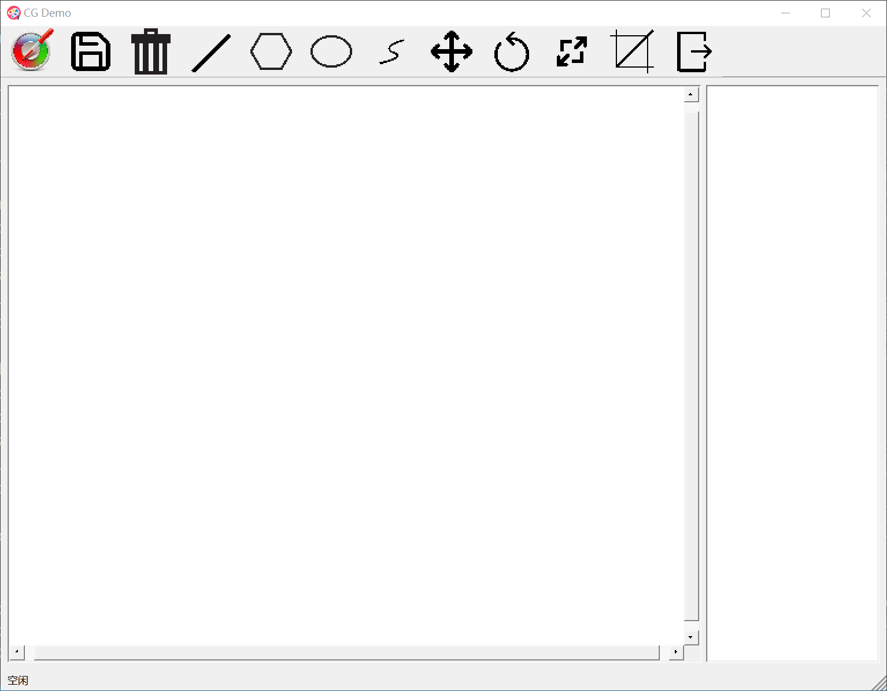

---

下面按从左到右的顺序介绍12个功能键作用。

- **取色**

  点击取色按键会弹出颜色界面，选择颜色后确定即可设置画笔颜色。

  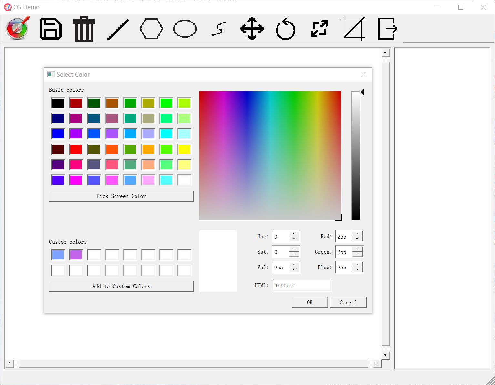

  

- **保存**

  点击保存按键后选择路径及名称，即可保存。

  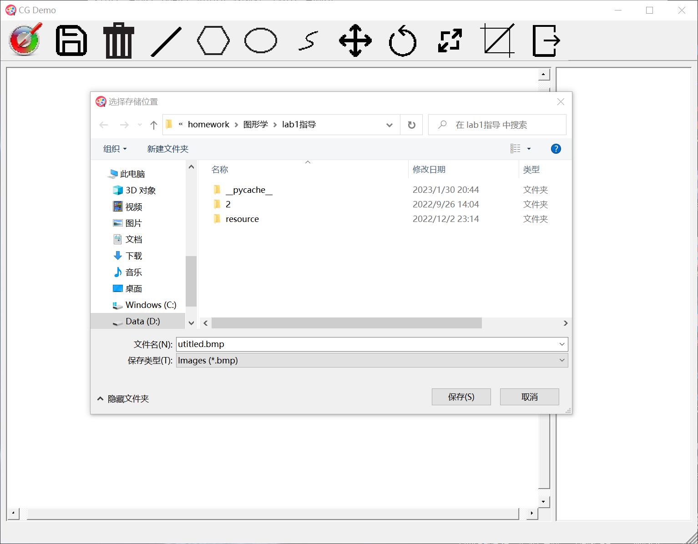

  

- **清空**

  点击后弹出确认框，可以调整画布大小，确认后清除画布上的所有痕迹，并将右侧选择框归零。

  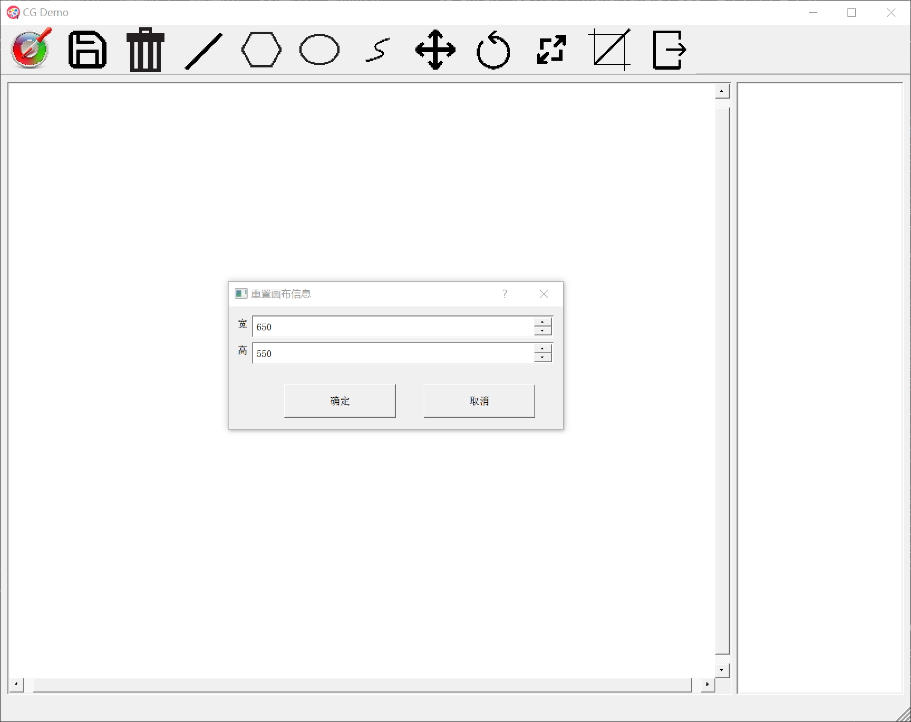

- **线段绘制**

  点击某个线段算法（如DDA）后，点击处视为起点，**拖拽后松开**确定终点，绘制结束。（注：右键点击无效，下同）

  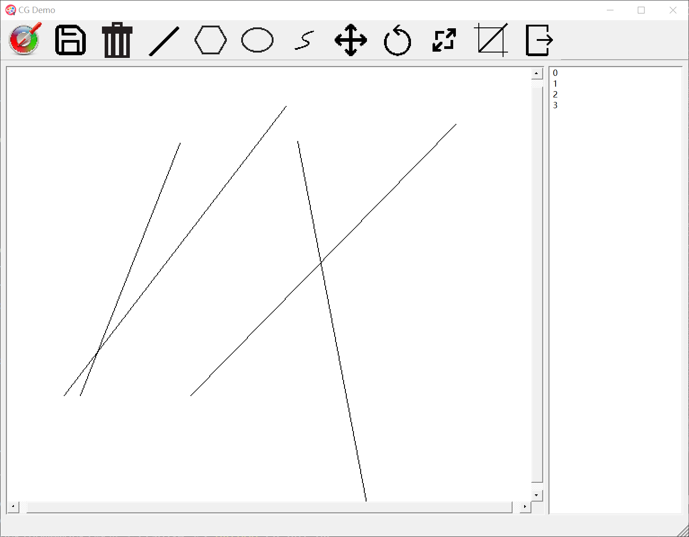

  

- **多边形绘制**

  每次**点击**都确定一个顶点，无需拖拽。最后**双击**确定最后一个顶点并结束。

  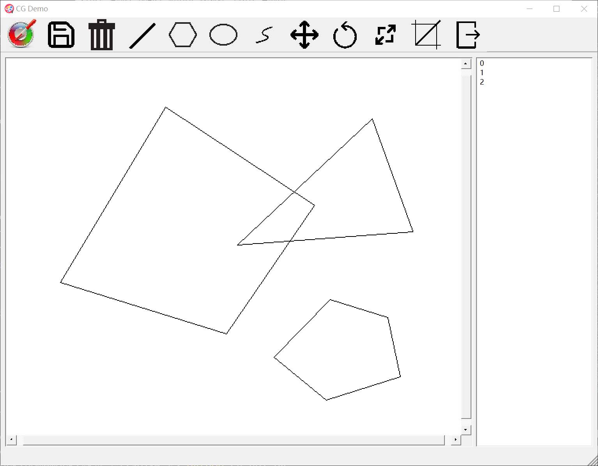

  

- **椭圆绘制**

  与线段类似，**拖拽**确定范围，生成的椭圆为拖拽形成的矩形的内切椭圆。

  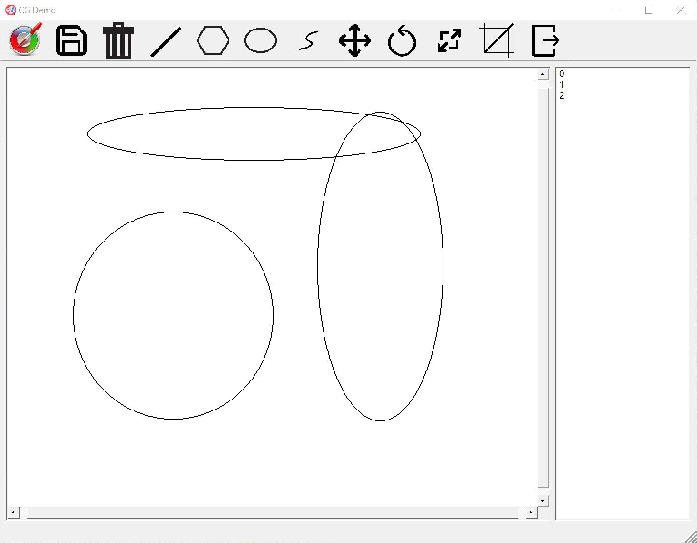

- **曲线绘制**

  与多边形绘制类似，每次**点击**确定一个基准点，最后**双击**确定最后一个基准点并结束绘制。（由于曲线的绘制对计算机开销较大，后续再绘制会造成一定的卡顿，建议单独测试）

  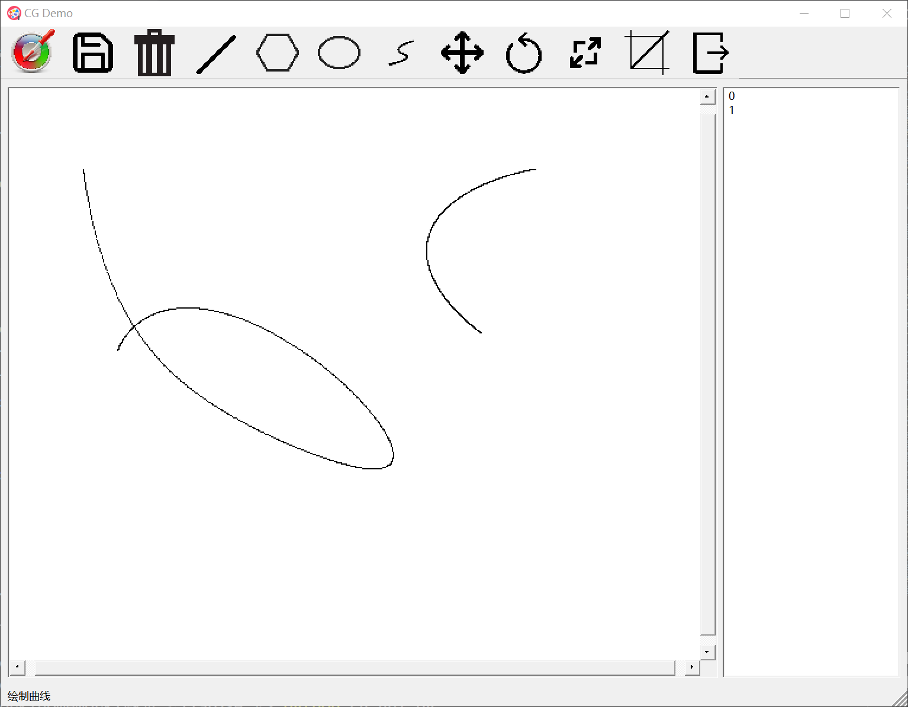

- **平移**

  点击平移功能键，再在右方数字列表里选择一个图形，即可拖拽图形。

- **旋转**

  点击旋转功能键，再在右方数字列表里选择一个图形，即可实现旋转，这里旋转中心为所有点的位置平均数（中心点）。在旋转和下面的缩放操作时，图形中都会显示出绿色的中心点，帮助用户确定范围。

  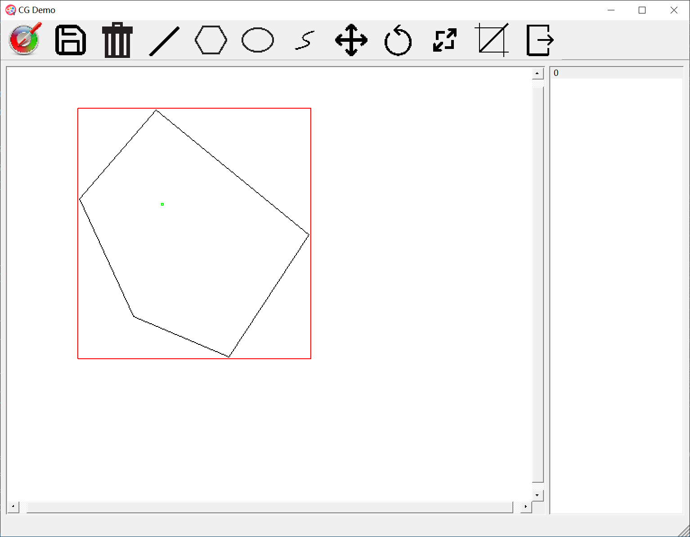

​		

- **缩放**

​		点击缩放功能键，再在右方数字列表里选择一个图形，即可实现缩放。这里缩放中心与旋转中心相同，缩放倍数按照（鼠标现在位置离缩放中心距离）/（鼠标点击位置离缩放中心距离）来计算。

- **剪切**

  点击剪切功能键，再在右方数字列表里选择一个图形，即可通过拖拽矩形框的方式进行剪切。其中红色矩形框为被选择的图形，蓝色矩形框是用户自己确定的剪切范围。

  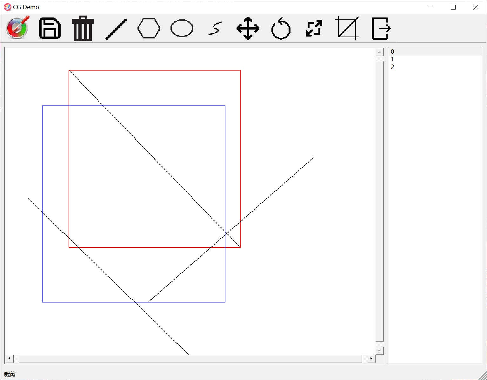

- **退出**

  点击退出键后会弹出一个对话框，询问是否确认退出或需要保存。

  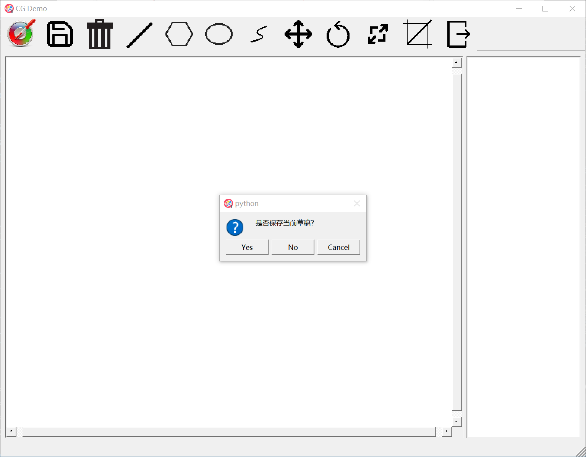

